# AutonomousDriving


Autonomous driving perception including segmentation and detection.

```
.
├── chcekpoint
|   └── *
├── config
├── core
|   ├── models
|   └── *.py
├── data
|   └── BDD100K
├── runs
|   └── *
├── tool
|   └── *.py
├── *.py
├── LICENSE
└── README.md
```

Dataset used in this project is [BDD100K](http://bdd-data.berkeley.edu/index.html), check [license](http://bdd-data.berkeley.edu/portal.html#download)

## Model

Use GAN loss as segmentation loss

## Train

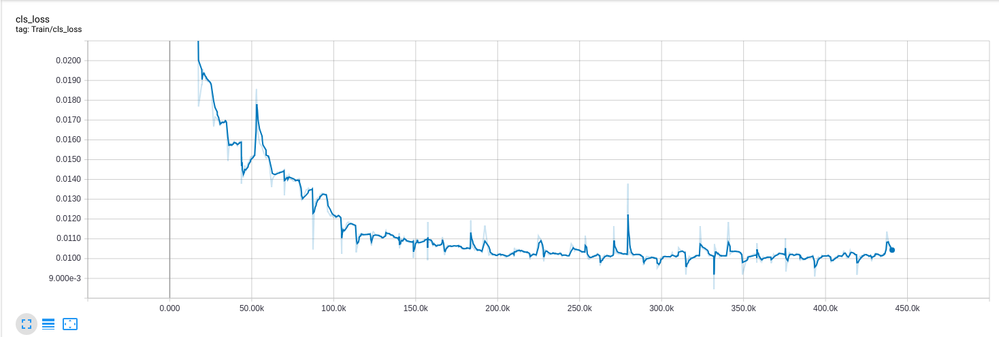
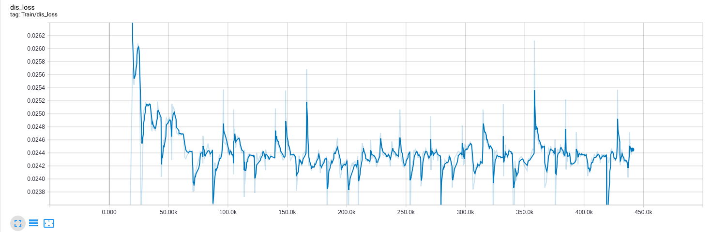
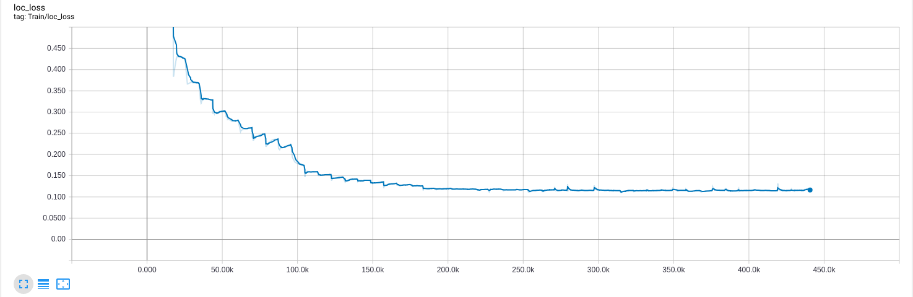
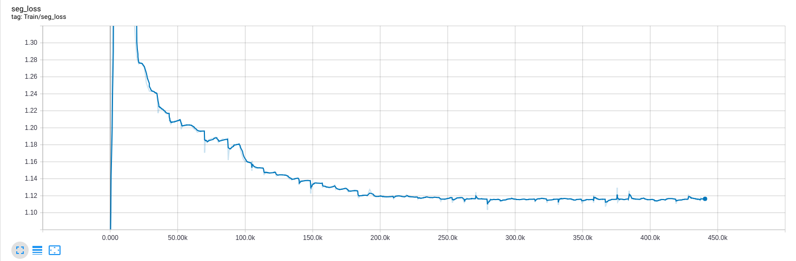

## Result

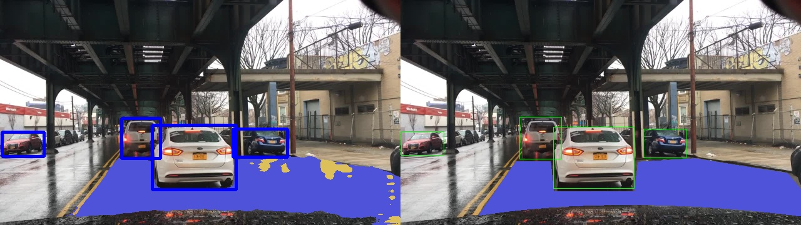
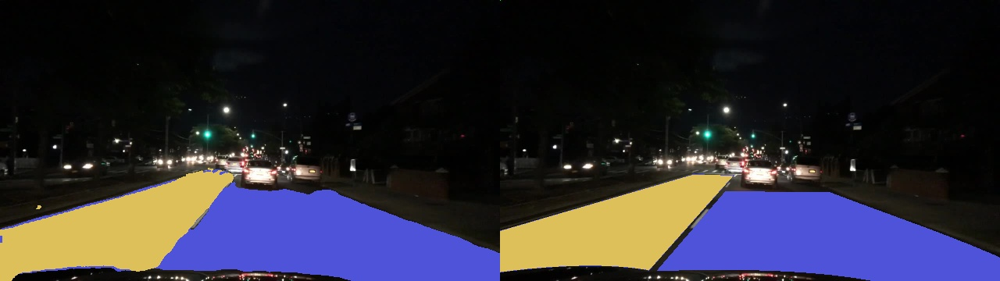
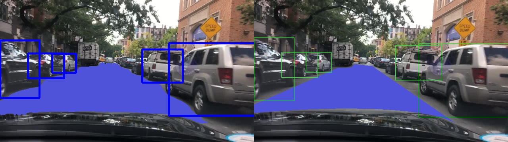
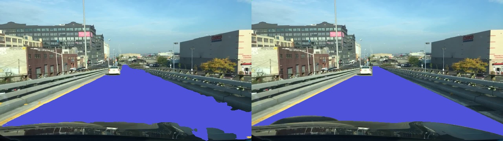
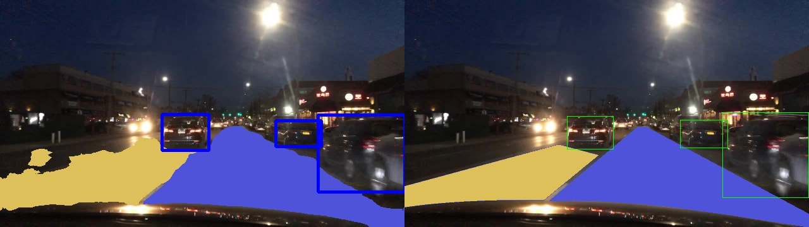
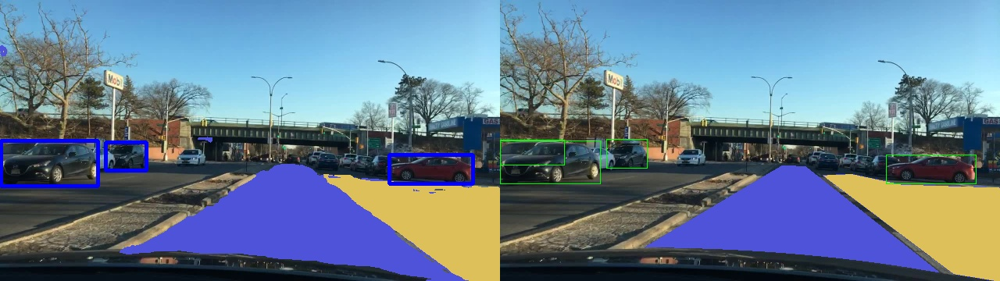
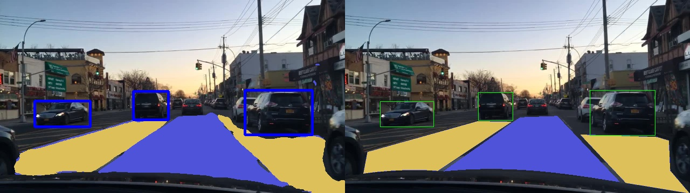
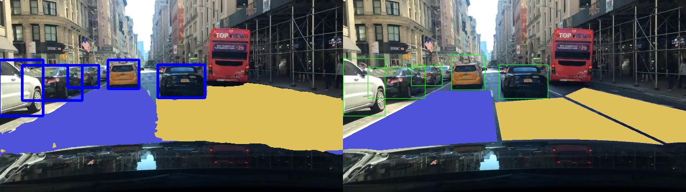
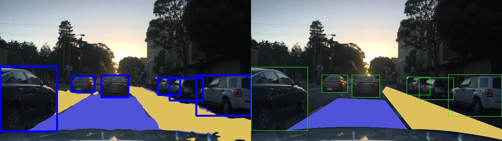
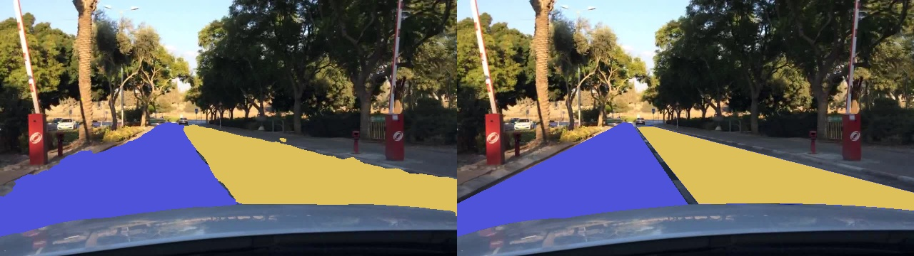

## License

Permission to use, copy, modify, and distribute this software and its documentation for educational, research, and not-for-profit purposes.
